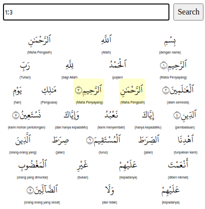

## Run kotlin webserver

Make sure you're already install Kotlin cli

`$ kotlinc sqws2.kt; kotlin -cp ".:./sqlite-jdbc-3.32.3.2.jar" sqws2`

## browse

type `1` on application search bar. Or `1:3` for a more specific search (ayah).

